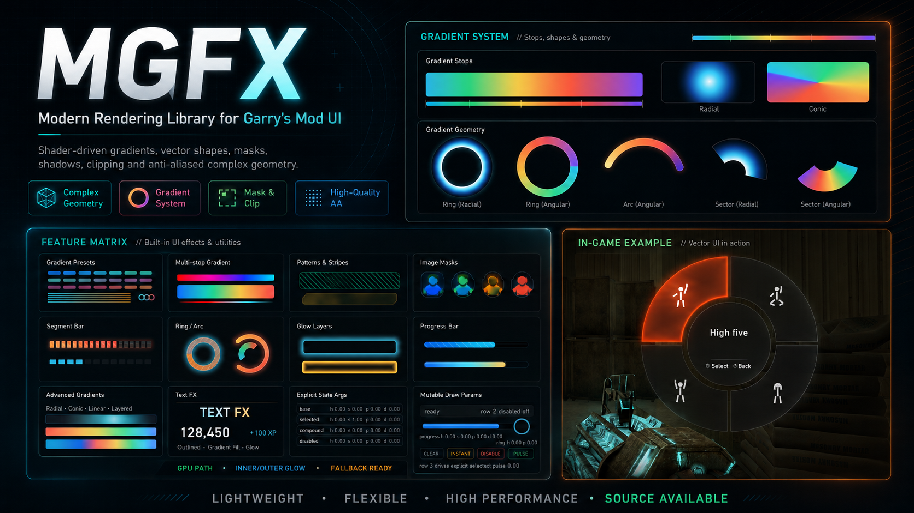

# MGFX

**Source-available, shader-backed immediate rendering for Garry's Mod UI.**



This repository now carries two maintained MGFX implementations:

- `lua-mgfx/` is the plain GLua addon. This is the source to copy or package for non-Lux Garry's Mod projects.
- `lux-mgfx/` is the Lux package project. It contains the Lux source tree, shader tooling, and the legacy generated loader output.
- `docs/` is the shared documentation source for both implementations.

MGFX is a renderer, not a UI framework. It provides immediate draw calls for rounded shapes, chamfers, polygons, rings, progress widgets, images, text effects, gradients, masks, glow layers, backdrop effects, and shader-backed polish. Layout, input, focus, animation state, and panel lifecycle stay in caller code.

## Install

For a plain Lua addon, use `lua-mgfx/` as the addon root:

```text
garrysmod/addons/mgfx/
  lua/
  materials/
  resource/
  addon.json
```

Garry's Mod loads the autorun files automatically and exposes `MGFX.*` on the client.
`MGFX.api` points to the same table for code that wants the same facade shape as Lux.

For a Lux project, install the package set from the repository root:

```powershell
luxc install @lux/mgfx --from github:TimeWatcher/lux-mgfx --tag v0.1.0
```

Local checkout:

```powershell
luxc install @lux/mgfx --from C:\Development\gmod\lux-mgfx
```

The root `lux.package.toml` points to `lux-mgfx/lux/mgfx`, so existing Lux install commands can keep using the repository root.
Lux code should use `@lux/mgfx` and its unified `mgfx.api` facade; the old paint-layer module is gone, and internal primitive/widget packages are not application entry points. The Lux facade initializes its default runtime automatically; `installGlobal("MGFX")` is only needed when you want to expose a global GLua-style table.

## Effects

`shadow`, `outerGlow`, and `backdrop` are separate effects:

- `shadow` is an external soft pass for shader-backed shapes. It supports `x/y`, `offsetX/offsetY`, `dx/dy`, `offset = {x, y}`, `blur`, `spread`, `opacity`, `softness`, and color/tint. Shader paths now render shadow from the full solid shape mask, while `outerGlow` remains exterior-only.
- `outerGlow` is an external glow pass. It supports the same offset aliases, but defaults to no offset.
- `backdrop` samples and tints the background inside the current shape or image mask. It is not a shadow.

Backdrop blur is shared per engine render frame. The first blurred backdrop
captures the framebuffer and builds the completed two-pass full-screen blur;
later shapes reuse it through a single masked texture sample. Use
`backdrop = {blur = 6, recapture = true}` only when a later draw must include
newly rendered framebuffer content or deliberately start a different blur
intensity. That explicit recapture becomes the shared source for subsequent
backdrops in the same frame.

The API fields stay separate, but the renderer may fuse compatible `shadow` and `outerGlow` layers into one shader pass for rounded boxes, chamfers, rings, and image masks. That optimization preserves the CSS-like visual result while avoiding duplicate Lua setup and material parameter uploads.

`RoundedBoxEx.shadow` also accepts CSS-style multiple layers:

```lua
shadow = {
    {x = 0, y = 1, blur = 2, color = Color(0, 0, 0, 90)},
    {x = 0, y = 8, blur = 24, color = Color(0, 0, 0, 80)},
}
```

Use this instead of stacking multiple full `RoundedBoxEx` calls just to create
layered shadows. MGFX parses the layer list once at the API boundary, draws only
the shadow passes for each layer, then draws fill/stroke/backdrop/innerGlow once.

`innerGlow` remains clipped inside the shape and does not use offset.

## Material Patterns

Patterns are shader paint slots for surfaces, not recipes for drawing extra
geometry. Use `MGFX.WornPattern(...)` when a flat fill or simple gradient needs
subtle material texture:

```lua
pattern = MGFX.WornPattern({
    color = Color(0, 0, 0, 44),
    edgeColor = Color(218, 208, 184, 78),
    fractal = 0.44,
    grain = 0.64,
    scratches = 0.30,
    edge = 0.54,
    scale = 32,
    grainScale = 5.6,
    scratchScale = 26,
    scratchWidth = 0.045,
    edgeWidth = 7,
    angle = -14,
    warp = 0.035,
    seed = "inventory-card",
})
```

The intended look is a dulled rough surface with sparse scuffs, short scratches,
and broken edge wear. `grain` is the main roughness control, `fractal` adds soft
irregular scuffs, `scratches` should stay sparse, and `edge` controls local
edge damage. Full parameter guidance is in the
[Paint Reference](docs/api-reference/paint.md#wornpattern).

## Performance Status

The current hot path is optimized around direct immediate drawing, not a
general batching scheduler. Public `NameEx(..., style)` calls still accept style
tables, but renderer internals now flatten those records at the API boundary and
pass prepared scalar/fill/effect parameters through the actual draw layers.

Recent in-game testing on a complex shop UI showed stable 130+ FPS with a full
item list and 160+ FPS in lighter categories with diagnostics disabled.

## Documentation

The documentation is shared by both implementations:

- [Online Documentation](https://timewatcher.github.io/mgfx-docs-site/)
- [Plain GLua Quick Start](docs/guide/glua.md)
- [Lux Quick Start](docs/guide/lux.md)
- [Core Concepts](docs/guide/concepts.md)
- [API Reference](docs/api-reference/index.md)
- [Performance Notes](docs/PERFORMANCE.md)
- [Internal Architecture](docs/ARCHITECTURE.md)
- [Text Renderer](docs/TEXT.md)
- [Shader Build And Packaging](docs/SHADERS.md)

The docs website is built with VitePress from the repository root:

```powershell
npm install
npm run docs:dev
npm run docs:build
```

The generated site is written to `docs-site/`.

## Changelog

### 2026-07-22

#### Shape Strokes And Rendering

- Added centered shape strokes with `solid`, `dot`, `dash`, and `dot-dash` kinds across rounded rectangles, chamfers, polygons, rings, arcs, sectors, progress bars, and segment bars. Non-solid strokes use an isolated shader pass with a CPU fallback, while the legacy `stroke = Color(...)` plus `strokeWidth` API remains supported.
- Added matching stroke shader sources, compiled shader assets, plain Lua support, and interactive `mgfx_demo` / `mgfx_stroke_demo` examples.
- Fixed backdrop-only rounded rectangles so they stop after the backdrop pass instead of submitting a transparent base shape.
- Added layered backdrop blur through integer `backdrop.level`. Matching frame/level/intensity requests reuse the prepared result, intensity changes rerun the separable blur without another framebuffer copy, and higher levels recapture after lower UI layers have drawn.

#### API And Performance

- Added `CompileStyle` / `CompileBackdrop` and normalized style markers so callers can reuse prepared backdrop and pattern specs without repeated table normalization.
- Added allocation-light `RoundedBoxBackdrop`, `LineNoCaps`, and `ImageUV` APIs in both the Lux and plain Lua implementations.
- Reduced `StartPanel` overhead by avoiding profiler metadata while profiling is disabled, pooling clip/command records, and skipping empty command-frame setup.
- Removed deep style copying from transformed draw paths and cached pattern seeds, font heights, UTF-8 character runs, and per-character widths used by native text fallback rendering.
- Fixed `lineHeightFor` font measurement and removed per-character `GetTextSize` calls from `drawLayout`.
- Synchronized the Lux sources, generated precompiled runtime, plain Lua implementation, shader packs, API reference, performance notes, and bilingual documentation.

### Recent Development: 2026-06-19 to 2026-06-26

#### Rendering Fixes

- 2026-06-26 Replaced the old internal effect style/spec table pipeline with direct prepared parameters across the hot drawing layers. Public `NameEx(..., style)` calls still accept style tables, but rounded boxes, chamfers, progress/segment widgets, line-backed rectangles, and round/chamfer image effect paths now expand style fields at the boundary and pass scalar effect parameters internally.
- 2026-06-26 Removed internal shadow/outerGlow/innerGlow spec caches from the shader path. The measured cost was not GPU work; it was Lua-side table normalization, cache-key checking, repeated field lookups, and unnecessary pass forwarding.
- 2026-06-26 Added prepared `roundrect`, `progress`, `segment`, `image`, `line`, `poly`, and `chamfer` paths for composite widgets and primitive helpers so internal callers no longer construct temporary style tables just to call another MGFX shape renderer.
- 2026-06-26 Verified the optimized shop path in-game: full item lists hold 130+ FPS, and lighter categories hold 160+ FPS with diagnostics disabled.
- 2026-06-25 (`7096062`) Merged compatible `shadow` and `outerGlow` rendering for rounded boxes, chamfers, rings, and image masks into focused shader passes. The effects remain separate style fields, but matching draw bounds now share one material setup and one draw.
- 2026-06-25 (`7096062`) Moved hot-path auxiliary shader parameters from repeated `$c0..$c3` float uploads to the `$invviewprojmat` / `c15` matrix page where possible. `$viewprojmat` / `c11` remains the main 16-float page.
- 2026-06-25 (`7096062`) Added real profiler-driven round-rect chain tracing and cleaned the performance demo so hot sections can measure API resolve, setup, effect preparation, pass execution, and draw cost directly.
- 2026-06-25 (`7096062`) Fixed draw-color state leakage in shader-backed round-rect paths so later UI rows keep their intended fill instead of inheriting tinted material state.
- 2026-06-24 (`4fbd8f8`) Improved convex polygon shader antialiasing and moved polygon textured-quad paths away from lower-quality `DrawPoly` output where the Source UV path required correction.
- 2026-06-23 (`2788385`) Fixed text atlas isolation across independently bundled MGFX runtimes. Each text renderer now gets a process-wide unique atlas namespace, and render targets/materials use the same atlas page name. This prevents text shadows or composed text effects in one addon or window from sampling glyphs rendered by another addon.
- 2026-06-23 (`2788385`) Restored deterministic text atlas bake state for both Lua and Lux runtimes by enabling alpha writes and explicit blend state while drawing glyphs into the atlas, then restoring render state immediately after the bake pass.
- 2026-06-23 (`95eac72`) Fixed text effect atlas sampling so face, stroke, glow, and shadow passes read glyph coverage from the atlas rect only. This prevents text effect blur kernels from bleeding outside the intended glyph allocation.
- 2026-06-23 (`934d91a`) Fixed effect rendering semantics across the Lua and Lux implementations. `shadow` now uses a full blurred shape alpha mask like CSS `box-shadow`; it no longer reuses the exterior-only `outerGlow` formula that could leave hard transparent holes when offsets were applied.
- 2026-06-23 (`934d91a`) Added dedicated shadow draw paths and shader materials for rounded rectangles, chamfers, rings, image masks, and convex polygons. Shadow, outer glow, inner glow, and backdrop are now routed as separate effects instead of sharing ambiguous fallback behavior.
- 2026-06-23 (`934d91a`) Added automatic panel effect bleed handling. Effects that should extend outside the panel, such as `shadow` and `outerGlow`, temporarily expand clipping and scissor bounds based on their computed blur/spread extent, while fill, stroke, backdrop, and inner glow stay clipped to the panel.
- 2026-06-23 (`934d91a`) Reworked effect extent calculation to use the blur/falloff tail instead of fixed `width * 1.8` style padding. This reduces clipped shadow edges when blur radius or offset is large.
- 2026-06-23 (`934d91a`) Improved shape-aware backdrop and blur routing for round rects, chamfers, rings, polygons, and image masks, including better padding handling and shader-backed tint passes.
- 2026-06-21 (`c940f2d`) Fixed blurred polygon backdrop rendering in the plain Lua implementation, including the `drawMaterialPoly` binding issue hit by polygon backdrop blur.
- 2026-06-19 (`8ad24b2`) Fixed outer glow offset bias so offset glows are drawn with the correct expanded bounds instead of leaving asymmetric hard edges.
- 2026-06-19 (`7cee3b2`) Added true convex polygon shadow shaders, replacing lower-quality polygon shadow approximations.

#### Features And API

- 2026-06-27 Added shader-native `WornPattern` documentation and synchronized its defaults across the plain Lua and Lux shader paths. The worn model is tuned around subtle roughness, sparse scuffs, short scratches, and broken edge wear instead of smoke/noise overlays.
- 2026-06-19 (`dab15db`, `205be62`) Initialized and fixed the unified `MGFX.api` facade runtime for Lux. Lux users can call the unified API surface without choosing between primitive, widget, text, or style internals.
- 2026-06-19 (`d0018ae`) Unified the MGFX API facade and polygon helper APIs across Lua and Lux, including dedicated helpers for common polygon construction and shader-backed polygon effects.
- 2026-06-19 (`bacf4fd`) Loaded Lua MGFX demo commands by default so plain GLua users can run demo and inspection commands without manual includes.
- 2026-06-19 (`0b5e3b3`) Restructured the repository into `lua-mgfx/` and `lux-mgfx/`, with the plain Lua addon and the Lux package maintained side by side.

#### Documentation

- 2026-06-23 (`9f1809e`, `e98c392`) Documented the text atlas fixes and recent rendering changes in the shared README and documentation.
- 2026-06-20 (`5eea18a`) Added the English MGFX documentation site and VitePress build output workflow.
- 2026-06-19 (`c955c0f`) Linked the documentation site from project documentation.
- 2026-06-19 (`d99da27`) Expanded API documentation with practical examples, parameter guidance, effect semantics, and usage notes instead of only listing parameters.
- 2026-06-19 (`f50b128`) Moved MGFX documentation into the shared root `docs/` tree so both Lua and Lux implementations use one documentation source.

#### Build And Packaging

- 2026-06-25 (`7096062`) Rebuilt the shaderpack and Lux generated dist after adding fused effect shaders for both Lux and plain Lua runtimes.
- 2026-06-23 (`2788385`) Rebuilt the shaderpack at version `1782220800` and regenerated the Lux `dist/lua` output after the text atlas isolation fix.
- 2026-06-23 (`c9964cd`) Rebuilt the shaderpack at version `1782205200`, including the new dedicated shadow, outer glow, stroke, backdrop, and polygon shader outputs.
- 2026-06-23 (`959122c`) Rebuilt the Lux generated `dist/lua` output from the updated Lux sources.
- 2026-06-17 (`6b28641`, `92d3792`) Added and refreshed the precompiled MGFX Lua loader distribution for Lux consumers that need generated GLua output.
- 2026-06-17 (`ce1a7e1`) Fixed package diagnostics in MGFX source packages so Lux build/install errors are easier to identify.

## Layout

```text
docs/           Shared documentation source
lua-mgfx/       Plain GLua addon source
lux-mgfx/       Lux package source, shader tools, and legacy generated dist
scripts/        Shared documentation/tooling scripts
package.json
lux.package.toml
README.md
LICENSE*
NOTICE
```

`lux-mgfx/dist/lua` is the old Lux-generated GLua loader tree. The canonical non-Lux implementation is `lua-mgfx/`; future release packaging should prefer that pure Lua tree.

## License

MGFX source is available under the Lux MGFX Non-Commercial License. Commercial use requires separate written authorization. See `LICENSE`, `LICENSE-MGFX-NC`, and `NOTICE`.
