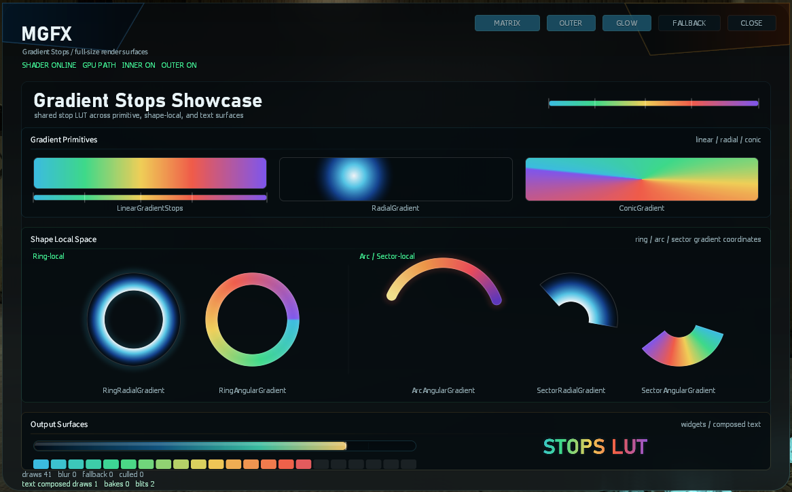
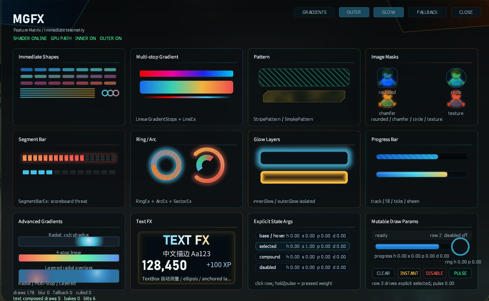
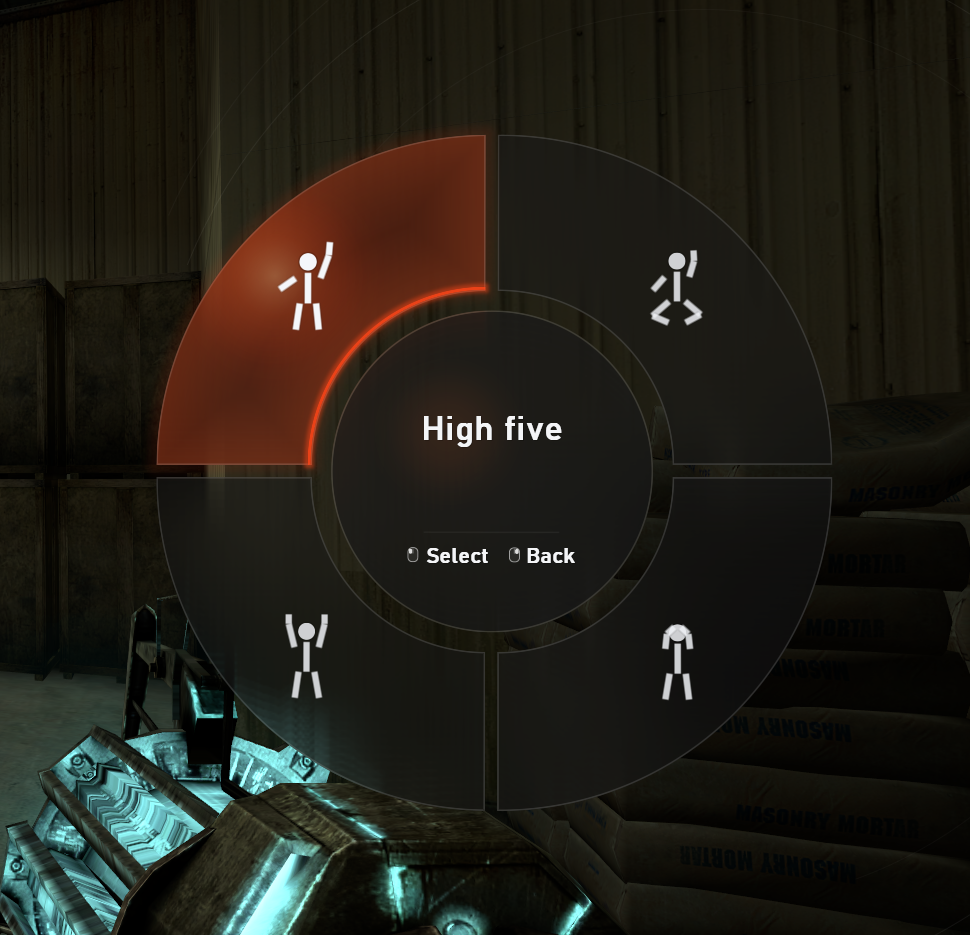

<div align="center">

# Lux MGFX

**Source-available, shader-backed immediate rendering for Garry's Mod UI.**

[](https://timewatcher.github.io/mgfx-docs-site/)
[](lux/mgfx/)
[](https://gmod.facepunch.com/)
[](#license)

[Documentation](https://timewatcher.github.io/mgfx-docs-site/) ·
[Install](#install) ·
[Use Without Lux](#use-without-lux) ·
[Examples](#draw-from-lux) ·
[License](#license)


</div>

MGFX is the Lux package set and shader tooling for modern Garry's Mod UI
drawing. It keeps the immediate-mode mental model of GLua painting, but moves
the expensive visual work into shader-backed primitives, explicit style
records, masks, gradients, glow, backdrop effects, and reusable package
modules.

Full documentation is available at
<https://timewatcher.github.io/mgfx-docs-site/>. Start with the
[Lux Quick Start](../docs/guide/lux.md), then use [Core Concepts](../docs/guide/concepts.md)
and the [API Reference](../docs/api-reference/index.md) as needed.

It is not a submodule of `lux`. It lives as a peer repository. Lux projects
consume it through `luxc install`; plain GLua projects should use the sibling
`../lua-mgfx` implementation and call the same `MGFX.*` facade.

## Why MGFX

- **Shader-backed UI primitives**: rounded boxes, chamfers, circles, capsules,
  polygons, lines, rings, arcs, sectors, progress bars, segment bars, images,
  icons, and text effects.
- **Full gradient system**: linear, radial, conic, ring-local, sector-local,
  angular, and multi-stop gradients share one normalized stop pipeline.
- **Shape-aware effects**: masks, strokes, inner glow, outer glow, backdrop
  blur, patterns, and image clipping follow each primitive's coverage.
- **Material wear pass**: `WornPattern` adds shader-native roughness, sparse
  scuffs, short scratches, and broken edge wear to flat or gradient UI
  surfaces without data textures or many extra primitive calls.
- **Focused effect fusion**: compatible shadow and outer-glow layers share one
  shader pass for rounded boxes, chamfers, rings, and image masks without
  changing the API fields.
- **Prepared hot paths**: public style tables are flattened at the API boundary
  and renderer internals pass scalar/fill/effect parameters instead of
  forwarding style tables through multiple layers.
- **Lux-native delivery**: imports, client realm ownership, package
  dependencies, generated loaders, and client file delivery are handled by
  `luxc gmod build`.
- **Plain GLua delivery**: the repository also carries `../lua-mgfx`, a pure
  Lua addon source tree for non-Lux projects.

MGFX is a renderer, not a UI framework. It does not own layout, input, focus,
component lifecycle, animation state, or hit testing. Your panel or UI layer
computes the current state each frame and passes explicit draw arguments to
MGFX.

## Showcase

### Gradient System



MGFX supports shared multi-stop gradients across primitive fills, shape-local
ring and sector surfaces, progress widgets, and composed text. The same style
records can be cached and reused across frames.

### Feature Matrix



The package covers common GMod UI building blocks: immediate shapes, patterns,
image masks, progress bars, segment bars, ring and arc widgets, glow layers,
advanced gradients, text FX, and explicit state-driven draw parameters.

### In-Game Example



The wheel demo shows MGFX drawing an in-game radial menu with sector geometry,
stroke layers, glow, translucent surfaces, icon rendering, and native GMod
input/state handled by the caller.

## Install

### Lux Projects

Install from GitHub:

```powershell
luxc install @lux/mgfx --from github:TimeWatcher/lux-mgfx --tag v0.1.0
```

Install from a local checkout:

```powershell
luxc install @lux/mgfx --from C:\Development\gmod\lux-mgfx
```

`luxc install` writes the project dependency entry and lockfile. MGFX package
dependencies are resolved from this package set automatically; users should not
list every `@lux/mgfx/*` module by hand.

After installing, import MGFX from Lux client code:

```lux
import { installGlobal } from "@lux/mgfx"

client {
  installGlobal("MGFX")
}
```

`installGlobal("MGFX")` exposes the PascalCase facade for GLua-facing panels
and legacy code. New Lux code should call the unified `mgfx.api.*` surface.

### Use Without Lux

Use `../lua-mgfx` as the source tree for plain GLua projects. It is a normal
Garry's Mod addon:

```text
lua-mgfx/
  lua/autorun/client/mgfx_loader.lua
  lua/autorun/server/mgfx_loader.lua
  lua/mgfx/*.lua
  materials/
  resource/
```

For normal addons, Garry's Mod loads the autorun files automatically. MGFX is
then available on the client:

```lua
hook.Add("HUDPaint", "MGFXExample", function()
  MGFX.RoundedBox(24, 40, 40, 260, 96, Color(18, 22, 30, 230))
  MGFX.TextEx("MGFX", "DermaLarge", 64, 62, Color(255, 255, 255))
end)
```

If your gamemode or integration layer owns the entry point, include the loader
explicitly from a path relative to `lua`:

```lua
if SERVER then
  include("autorun/server/mgfx_loader.lua")
end

if CLIENT then
  include("autorun/client/mgfx_loader.lua")
end
```

This Lux subproject still keeps `dist/lua` as a legacy generated loader output.
It is useful for comparing generated Lua, but the canonical non-Lux source is
`../lua-mgfx`.

## Draw From Lux

```lux
import * as mgfx from "@lux/mgfx"

client fn paintPanel(panel, w, h) {
  local draw = mgfx.api
  draw.startPanel(panel, w, h)

  draw.roundedBoxEx(0, 0, w, h, {
    radius = 12,
    fill = draw.linearGradient(0, 0, 1, 1, {
      {0.00, Color(35, 212, 232, 230)},
      {0.55, Color(80, 220, 160, 220)},
      {1.00, Color(245, 158, 11, 215)},
    }),
    shadow = {
      { x = 0, y = 1, blur = 2, color = Color(0, 0, 0, 88) },
      { x = 0, y = 8, blur = 18, spread = 2, color = Color(0, 0, 0, 118), softness = 0.62 },
    },
    backdrop = { blur = 8, tint = Color(3, 10, 16, 125) },
    innerGlow = { color = Color(255, 255, 255, 34), width = 18 },
    outerGlow = { color = Color(35, 212, 232, 72), width = 14, x = 0, y = 0 },
    pattern = draw.wornPattern({
      color = Color(0, 0, 0, 44),
      edgeColor = Color(218, 208, 184, 78),
      grain = 0.64,
      fractal = 0.44,
      scratches = 0.30,
      edge = 0.54,
      edgeWidth = 7,
      seed = "lux-panel",
    }),
  })

  draw.progressBarEx(24, h - 38, w - 48, 10, 0.72, {
    radius = 5,
    track = Color(7, 16, 22, 210),
    fill = draw.linearGradient(
      0, 0, 1, 0,
      Color(30, 130, 255, 240),
      Color(60, 220, 210, 240)
    ),
  })

  draw.endPanel()
}
```

For installed GLua-style tables, call `mgfx.installGlobal("MGFX")` or
`mgfx.api.installGlobal("MGFX")` and use `api.RoundedBoxEx(...)`. The generated
output is ordinary client Lua. Lux owns the package imports, realm split, source
maps, and GMod loader generation.

## Package Surface

`@lux/mgfx` is the normal entry point and exports the unified `mgfx.api` facade.
Subpackages remain importable for maintainers, narrow tooling, and generated
runtime integration, but ordinary UI code should not need to decide whether a
call lives in an internal shape, widget, text, style, or runtime package.

| Area | Packages |
| --- | --- |
| Public API | `@lux/mgfx`, `@lux/mgfx/api` |
| Internal renderer packages | `@lux/mgfx/roundrect`, `@lux/mgfx/primitives`, `@lux/mgfx/widgets` |
| Frame and commands | `@lux/mgfx/frame`, `@lux/mgfx/commands` |
| Styling | `@lux/mgfx/style`, `@lux/mgfx/capabilities` |
| Runtime support | `@lux/mgfx/geometry`, `@lux/mgfx/materials`, `@lux/mgfx/profiler`, `@lux/mgfx/shaderpack` |
| Text | `@lux/mgfx/text` |
| Developer tools | `@lux/mgfx/console`, `@lux/mgfx/demo`, `@lux/mgfx/wheel_demo` |

## Diagnostics

Install the console package during development if you want runtime status and
self-test commands:

```lux
import * as mgfx from "@lux/mgfx"
import * as console from "@lux/mgfx/console"

client fn installTools() {
  local api = mgfx.installGlobal("MGFX")
  console.install(api)
}
```

Useful commands and cvars:

```text
mgfx_status
mgfx_selftest
mgfx_reload
mgfx_demo
mgfx_profile 0/1
mgfx_draw_counts 0/1
mgfx_force_fallback 0/1
```

Disable diagnostics for real FPS checks. The counters and debug text add their
own overhead.

Recent complex shop UI testing with diagnostics disabled holds 130+ FPS with a
full item list and 160+ FPS in lighter categories.

## Shader Tooling

Most users do not need the shader tooling. MGFX ships precompiled Source shader
bytecode (`.vcs`) in the package tree and embeds the generated payload across
five `@lux/mgfx/shaderpack/chunkXX` packages. The small shaderpack facade joins
those chunks at runtime, keeping every generated Lua artifact below Garry's
Mod's large-file distribution limit.

Regenerate the legacy Lux-generated GLua loader tree with:

```powershell
.\tools\build-precompiled.ps1
```

Pass `-Luxc C:\path\to\luxc.exe` if `luxc` is not on `PATH`. The script builds
from a temporary Lux project, installs the local `@lux/mgfx` package set, and
writes `dist/lua`. New non-Lux release packaging should use `../lua-mgfx`.

Garry's Mod does not include a shader compiler, so the compiler binary used to
regenerate bytecode is stored as repository tooling under `tools/mgfx`. That
tooling is outside the Lux package module tree. It is not installed as a Lux
package and is not emitted into generated Lua unless MGFX code explicitly
embeds a packed shader module.

Useful maintainer commands:

```powershell
cd lux\mgfx\shadersrc
python .\build.py --pack-only
python .\build.py
```

`--pack-only` rebuilds the base64 shaderpack facade and chunk packages from
existing `.vcs` files.
Running without `--pack-only` invokes the bundled shader build chain first.

## License

MGFX source is available in this repository, but the runtime package is
licensed for non-commercial use under `LICENSE-MGFX-NC`. Commercial use
requires separate written authorization.

Repository tooling, documentation, and notices are covered by the license files
in this repository. Read `LICENSE`, `LICENSE-MGFX-NC`, and `NOTICE` before
shipping MGFX in a server, product, paid service, sponsored work, or other
commercial context.

## Related Projects

- Lux compiler and language: https://github.com/TimeWatcher/lux
- Lux standard packages: https://github.com/TimeWatcher/lux-packages
- MGFX documentation: https://timewatcher.github.io/mgfx-docs-site/
- Lux documentation: https://timewatcher.github.io/lux-docs-site/
